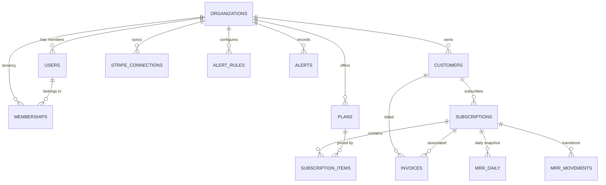

# RevPulse Database Schema & Architecture

RevPulse uses **PostgreSQL 16** with strict multi-tenant Row-Level Security (RLS), pure SQL metric pipelines, declarative monthly partitioning, and a concurrent materialized view for cohort retention.

---

## 1. Database Roles & Privilege Separation

| Role | Permissions | Security Configuration |
|---|---|---|
| `revpulse_migrator` | Superuser / DDL (`BYPASSRLS`) | Used exclusively by Alembic migrations and background seed scripts |
| `revpulse_app` | DML on `public.*` (`NOBYPASSRLS`) | Standard application connection pool; forced multi-tenant RLS checks on every query |
| `revpulse_readonly` | `SELECT` on `analytics.*` and `cohort_retention_mv` (`NOBYPASSRLS`) | Used by AI "Ask Your Data" engine; `statement_timeout = '3000ms'` |

---

## 2. Entity Relationship Diagram (ERD)



---

## 3. Core Tables & Indexing Strategy

### Multi-Tenant Tables (RLS Enforced)
- **`organizations`**: Tenant registry (`id`, `name`, `slug`, `plan_tier`, `created_at`).
- **`customers`**: Stripe customer mirrors (`org_id`, `stripe_id`, `email`, `name`, `delinquent`).
  - Index: `idx_customers_org_stripe(org_id, stripe_id)`, `idx_customers_org_delinquent(org_id, delinquent)`.
- **`plans`**: Billing tiers (`org_id`, `stripe_id`, `name`, `amount_cents`, `currency`, `interval`).
- **`subscriptions`**: Subscription records (`org_id`, `stripe_id`, `customer_id`, `status`, `current_period_start`, `current_period_end`, `trial_start`, `trial_end`).
  - Index: `idx_subscriptions_org_cust(org_id, customer_id)`, `idx_subscriptions_org_status(org_id, status)`.
- **`subscription_items`**: Sub-item quantity breakdown (`org_id`, `subscription_id`, `plan_id`, `quantity`).
- **`invoices`**: Billing history and at-risk overdue balances (`org_id`, `stripe_id`, `customer_id`, `amount_due_cents`, `status`, `period_end`).
  - Index: `idx_invoices_org_status(org_id, status)`.

### Metrics & Snapshots Tables
- **`mrr_daily`**: Primary key `(org_id, date, subscription_id)`.
  - Composite indexes:
    - `idx_mrr_daily_org_date(org_id, date)`: Instant KPI aggregations.
    - `idx_mrr_daily_sub_date(org_id, subscription_id, date)`: Accelerates `LAG()` window transitions.
    - `idx_mrr_daily_cust_date(org_id, customer_id, date)`: Accelerates customer first-seen cohort lookups.
- **`mrr_movements`**: Transition log (`org_id`, `date`, `subscription_id`, `customer_id`, `movement_type`, `amount_cents`, `prior_mrr_cents`, `current_mrr_cents`).
  - Index: `idx_mrr_movements_org_date(org_id, date)`, `idx_mrr_movements_org_type(org_id, movement_type)`.

---

## 4. Monthly Partitioned Event Log (`stripe_events`)

The `stripe_events` table is partitioned by `RANGE (created_at)` with monthly sub-tables to ensure high-velocity webhook ingestion without table bloat:
```sql
CREATE TABLE stripe_events (
    id UUID NOT NULL,
    org_id UUID NOT NULL,
    stripe_event_id VARCHAR(255) NOT NULL,
    event_type VARCHAR(100) NOT NULL,
    payload JSONB,
    processed BOOLEAN NOT NULL DEFAULT FALSE,
    created_at TIMESTAMPTZ NOT NULL,
    PRIMARY KEY (created_at, id)
) PARTITION BY RANGE (created_at);
```

---

## 5. Cohort Retention Materialized View (`cohort_retention_mv`)

Precomputes customer retention month-by-month for 100x query speedup:
```sql
REFRESH MATERIALIZED VIEW CONCURRENTLY cohort_retention_mv;
```
Indexed uniquely on `(org_id, cohort_month, period_month)` to permit zero-downtime concurrent refreshes.
