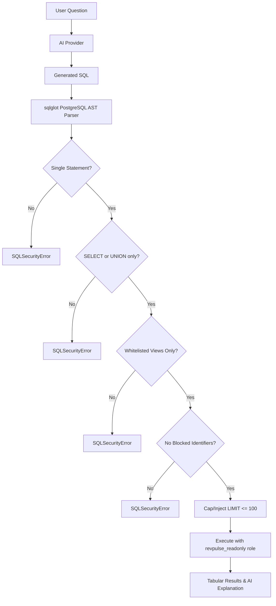

# RevPulse Security & Multi-Tenancy Architecture

RevPulse adopts a **Defense-in-Depth** security philosophy designed to guarantee zero data leakage between SaaS tenants and absolute safety when executing AI-generated queries.

---

## 1. Kernel-Level Tenant Isolation (PostgreSQL Row-Level Security)

Rather than relying solely on developers remembering `WHERE org_id = :org_id` in application code, tenant isolation is strictly enforced at the **PostgreSQL kernel level**:

### RLS Policy Definition
```sql
ALTER TABLE customers ENABLE ROW LEVEL SECURITY;
ALTER TABLE customers FORCE ROW LEVEL SECURITY;

CREATE POLICY tenant_isolation_policy ON customers
    FOR ALL
    TO revpulse_app
    USING (org_id = NULLIF(current_setting('app.current_org_id', true), '')::uuid)
    WITH CHECK (org_id = NULLIF(current_setting('app.current_org_id', true), '')::uuid);
```

### Transaction-Scoped Parameterization
When a session is acquired for tenant `org_id`, RevPulse executes:
```sql
SELECT set_config('app.current_org_id', :org_id, true);
```
- The third parameter `is_local = true` ensures that the setting is scoped strictly to the current database transaction.
- When the transaction ends or the connection returns to the connection pool (e.g. PgBouncer or Supabase transaction pooler), the configuration automatically resets.
- If `app.current_org_id` is missing or unset, queries fail-safe to returning 0 rows.

---

## 2. API Key Encryption at Rest (AES-128 Fernet)

Stripe Restricted API keys are encrypted at the application boundary prior to database storage:
- **Cipher**: Symmetrically encrypted using `cryptography.fernet.Fernet` (AES-128 in CBC mode with PKCS7 padding and HMAC-SHA256 authentication).
- **Key Storage**: Master key provided via `STRIPE_ENCRYPTION_KEY` environment variable. Plaintext keys are never logged or committed.

---

## 3. AI "Ask Your Data" AST SQL-Guard

RevPulse's natural language AI query assistant does **not** have direct access to database tables or arbitrary SQL execution. Every generated query passes through a multi-stage Abstract Syntax Tree (AST) validator:



### Guard Enforcements
1. **Single Statement Only**: Multi-statement payloads (e.g. `; DROP TABLE customers;`) are rejected.
2. **Read-Only Expressions**: Any statement other than `Select` (e.g. `INSERT`, `UPDATE`, `DELETE`, `DROP`, `ALTER`, `CREATE`, `TRUNCATE`) raises `SQLSecurityError`.
3. **Strict View Whitelist**:
   - `analytics.v_mrr_summary`
   - `analytics.v_plan_performance`
   - `analytics.v_at_risk_revenue`
   - `analytics.v_customer_cohorts`
   - `cohort_retention_mv`
   All base tables (`customers`, `users`, `stripe_connections`, `invoices`) are inaccessible.
4. **Blocked Identifiers**:
   `pg_read_file`, `pg_write_file`, `pg_sleep`, `dblink`, `version`, `current_user`, `information_schema`, `pg_catalog`, `pg_shadow`, `pg_roles`.
5. **Statement Execution Timeout**:
   Executed under the `revpulse_readonly` role with `statement_timeout = '3000ms'`.
